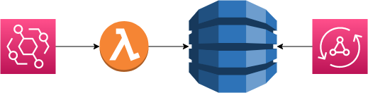

# the-christmas-challenge
Kotlin + AWS serverless workshop

## Architecture

In this workshop we are going to build a simple event driven application that processes events on event bridge with AWS Lambda; saves the result in DynamoDB NoSQL database; and exposes the data via GraphQL through AWS AppSync:

At the end of the workshop you should have an understanding of how to build, configure and deploy an AWS serverless application in Kotlin using CDK in Kotlin.

Some useful links on event driven architecture:
* https://aws.amazon.com/blogs/compute/getting-started-with-event-driven-architecture/
* https://aws.amazon.com/event-driven-architecture/
* https://docs.aws.amazon.com/lambda/latest/operatorguide/event-driven-architectures.html
* https://aws.amazon.com/blogs/compute/building-an-event-driven-application-with-amazon-eventbridge/

> **_NOTE:_** Performance tuning, unit and integration tests are not in scope of this workshop.

## Instructions

1. [Prerequisites](instructions/1-prerequisites.adoc)
2. [Generate and configure workshop project](instructions/2-generate-workshop-project.adoc)
3. [Add EventBridge event bus](instructions/3-add-event-bus.adoc)
4. [Add DynamoDB table](instructions/4-add-dynamoDB.adoc)
5. [Add AppSync GraphQL API](instructions/5-add-app-sync.adoc)
6. [Extra challenges](instructions/6-extra-challenges.adoc)
7. [Clean up resources](instructions/7-clean-up.adoc)
