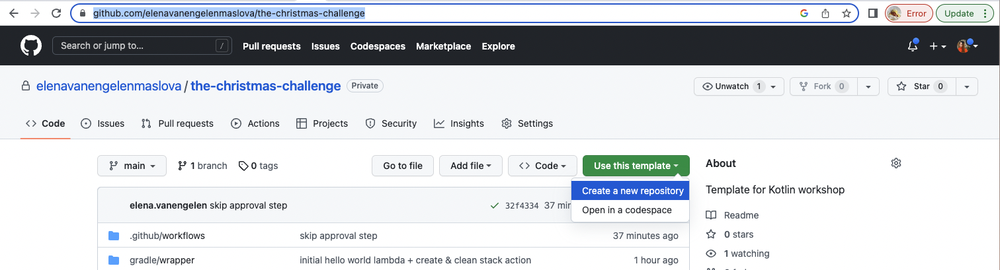
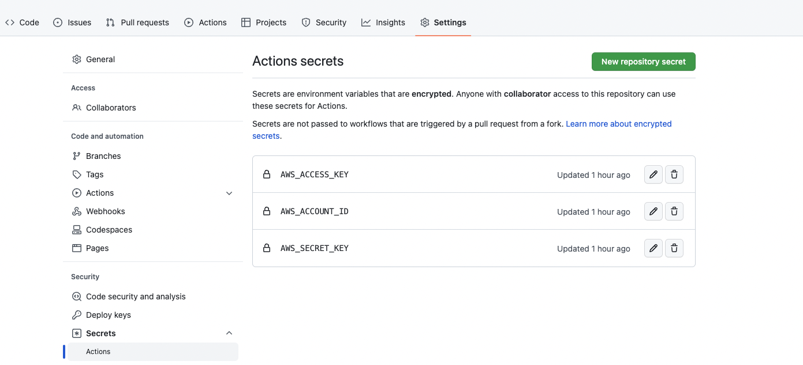
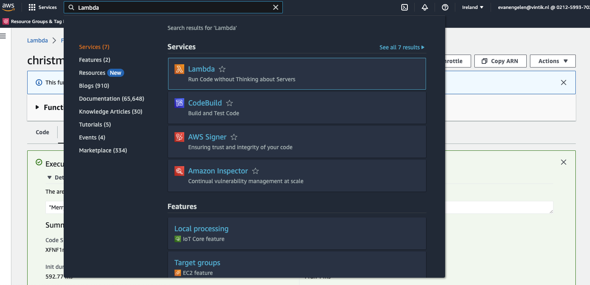
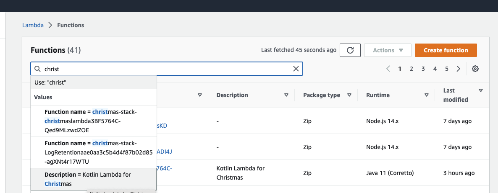
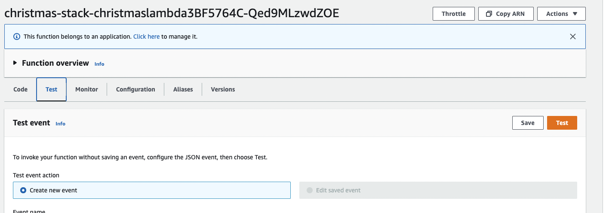
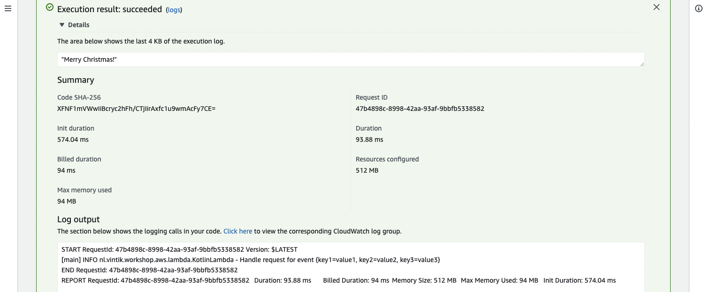

= 2. Generate and configure a workshop project in GitHub

== 2.1 Use template to create workshop project

In GitHub, on the main repository page of https://github.com/elenavanengelenmaslova/the-christmas-challenge template, select "Use this template" and then "Create new repository", see below:

== 2.2 Configure GitHub access to AWS

Configure AWS access keys in GitHub Secrets:

Where `AWS_ACCOUNT_ID` is your AWS Account Id, `AWS_ACCESS_KEY` is your AWS Account Access Key and `AWS_SECRET_KEY` is your AWS Account Secret Key.

NOTE: It is not recommended to use root AWS account for this. If you created a new AWS account when setting up the prerequisites, then follow instructions to secure your account link:https://docs.aws.amazon.com/IAM/latest/UserGuide/id_root-user.html[AWS account root user], then for the workshop use an IAM user with AdministratorAccess permissions.

== 2.3 Test configuration is working

To test GitHub configuration, go to GitHub actions tab and run `Kotlin AWS Christmas Workshop CI/CD` to deploy "Merry Christmas!" AWS Lambda to your AWS account.

When pipeline is green, login to AWS account and go to Lambda Service:

Search for "Christmas" in Lambda search bar and select one with description `Kotlin Lambda for Christmas`

Go to the Test tab and press Test button:

Clap out "Details" under "Execution result: succeeded" message to see the log output:

➡️ link:./3-add-event-bus.adoc[3. Add event bus on AWS EventBridge]

⬅️ link:./1-prerequisites.adoc[1. Prerequisites]
