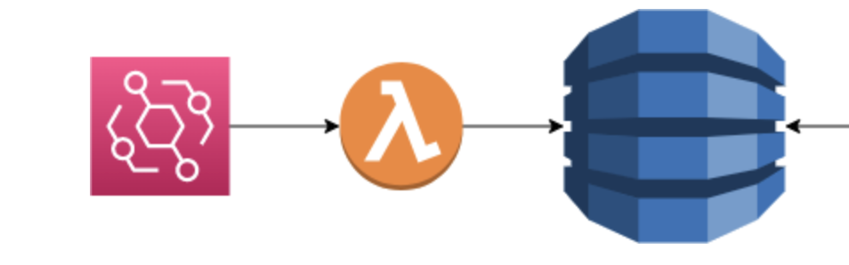
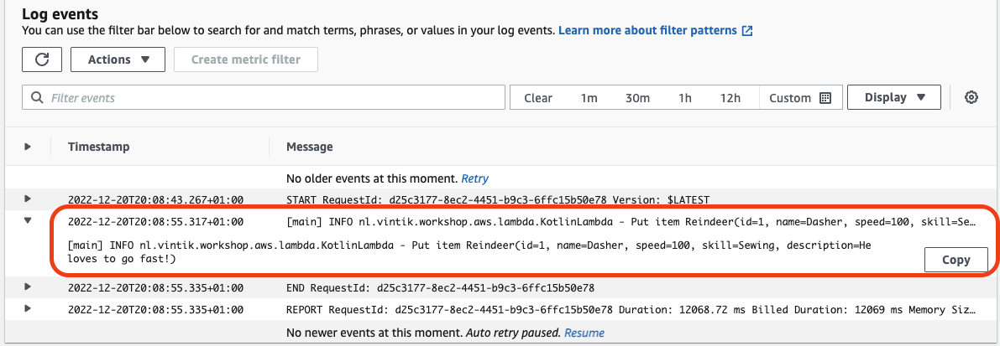
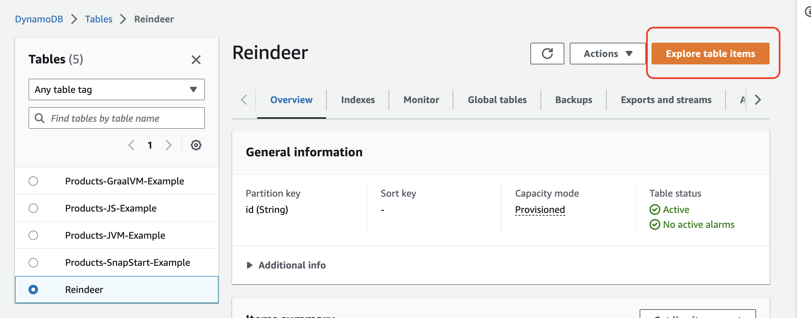
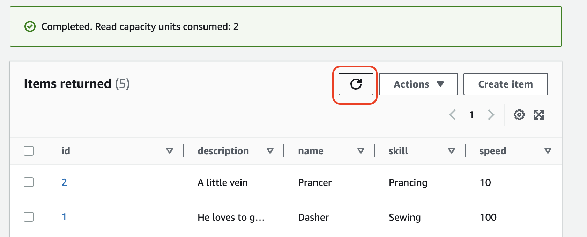

= 4. Write to DynamoDB Table

In this part of the exercise we are going to create a DynamoDB table where we can save our Reindeer payload. Then we need to add permission to our Lambda to write to the new table. Finally, we need to add code to the lambda to save the event payload to the new table.

== 4.1 Add DynamoDB Table in CDK infrastructure

Add a DynamoDB table `Reindeer` to our `InfrastructureChristmasStack` CDK stack. Configure `id` as partition key, and set provisioned read and write capacity to 12. Free tier allows up to 25 read and 25 write capacity units.

NOTE: For more information, see link:https://docs.aws.amazon.com/amazondynamodb/latest/developerguide/HowItWorks.ReadWriteCapacityMode.html[Read/write capacity mode]

[source,kotlin]
----
        val tableName = "Reindeer"
        val reindeerTable = Table.Builder.create(this, tableName)
            .tableName(tableName)
            .partitionKey(
                Attribute.builder()
                    .type(AttributeType.STRING)
                    .name("id")
                    .build()
            )
            //Note: for workshop DESTROY setting is good because when we clean up we do not want to retain anything.
            //On production usually one would use RETAIN or SNAPSHOT so that the data is not lost if the stack is deleted.
            .removalPolicy(RemovalPolicy.DESTROY)
            .pointInTimeRecovery(false)
             //Setting to keep ourselves within the free tier
            .billingMode(BillingMode.PROVISIONED)
            .readCapacity(12)
            .writeCapacity(12)
            .build()

        reindeerTable.grantWriteData(function)
----

Because in this assignment we are not going to transform the event payload in any way, we can just reuse the data class `Reindeer` as a database object.

Let us add AWS SDK DynamoDB enhanced client annotations to it. In addition, let us add schema and table definitions as statics to the same class.

[source,kotlin]
----
@DynamoDbBean
data class Reindeer(
    @get:DynamoDbPartitionKey
    var id: String = "",
    var name: String = "",
    var speed: Int = 0,
    var skill: String? = null,
    var description: String? = null
)
{
    companion object {
        private const val TABLE_NAME = "Reindeer"

        private val schema: TableSchema<Reindeer> = TableSchema.fromClass(Reindeer::class.java)

        private val dynamoDbAsyncClient: DynamoDbEnhancedAsyncClient = DynamoDbEnhancedAsyncClient.builder()
            .dynamoDbClient(
                DynamoDbAsyncClient.builder()
                    .region(Region.EU_WEST_1)
                    .build()
            ).build()

        val reindeerTable: DynamoDbAsyncTable<Reindeer> = dynamoDbAsyncClient.table(
            TABLE_NAME,
            schema
        )
    }
}
----

Finally, we need to update the Lambda handler to save event payload to our new table.

Normally Lambda handler will not have business logic, but would call a controller that in turn calls one or more services, but for this simple workshop we are just going to update the code in the handler `KotlinLambda`:

[source,kotlin]
----
    override fun handleRequest(event: EventBridgeMessage<Reindeer>, context: Context): String {
        //if payload is present, add or replace it in the Reindeer table (put)
        event.detail?.let {
            reindeerTable.putItem(it).join()
            logger.info("Put item $it")
        }
        return "Merry Christmas!"
    }
----

To build the changes locally you can run in the root of the project:

[source,sh]
----
./gradlew build
----

Now we can commit and push our changes, and then after CI/CI pipeline in GitHub have succeeded, we can check that event payload has been saved to the database.

Send Reindeer event again, same as in link:./3-add-event-bus.adoc[section 3]:

[source,json]
----
{
  "id": "1",
  "name": "Dasher",
  "speed": 100,
  "skill": "Sewing",
  "description": "He loves to go fast!"
}
----

Check event has been processed by Lambda. The lambda log should have a log entry containing Reindeer event payload:

Now go to DynamoDB service, select `Reindeer` table.

NOTE: The table item count is not real time, you can perform live item count which scans the whole table. This is not recommended when tables have a lot of data.

Select button "Explore table items":

Press the refresh button to see your new item in the table:

NOTE: If refresh button is disabled, you may need to refresh the browser page, as any query settings in the query form above disables the refresh button.

➡️ link:./5-add-app-sync.adoc[5. Add AppSync configuration for GraphQL]

⬅️ link:./3-add-event-bus.adoc[3. Add event bus on AWS EventBridge]