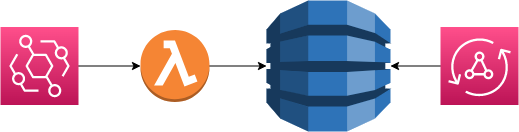
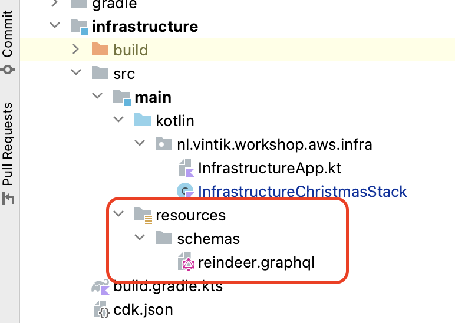
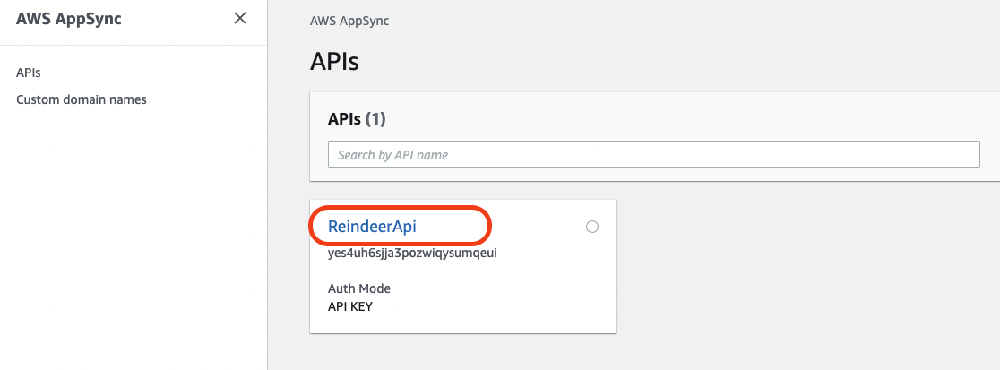
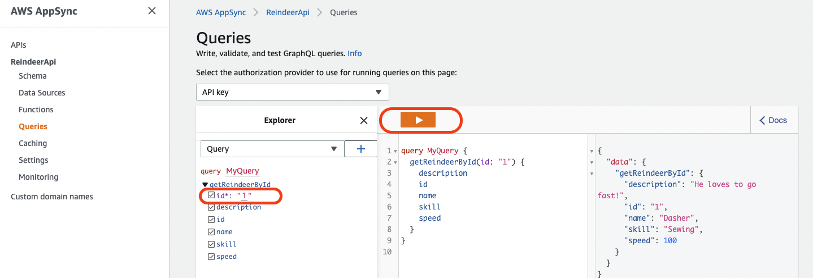

= 5. Add AppSync GraphQL API

As a final part to our simple event driven application, we shall expose our data via GraphQL though AppSync.

For this task we only need to update our infrastructure.

First let us define our graphql schema. In `infrastracture` -> `src` -> `main` create the following `resources` structure:

Put the following schema definition in the `reindeer.graphql`:

[source,graphql]
----
type Reindeer {
    id: String!
    name: String!
    speed: Int!
    skill: String
    description: String
}

type Query {
    getReindeerById(id: String!): Reindeer
}

type Schema {
    query: Query
}
----

Finally, let us add GraphQL API to our `InfrastructureChristmasStack`:

[source,kotlin]
----
        //Add GraphQL API to get Reindeers
        val apiName = "ReindeerApi"
        val reindeerApi = GraphqlApi.Builder.create(this, apiName)
            .name(apiName)
            .schema(SchemaFile.fromAsset(this::class.java.getResource("/schemas/reindeer.graphql")!!.path))
            .authorizationConfig(
                AuthorizationConfig.builder()
                    .defaultAuthorization(
                        AuthorizationMode.builder()
                             //API Key is the simplest authorisation option, good enough for our workshop
                            .authorizationType(AuthorizationType.API_KEY).build()
                    ).build()
            ).logConfig(
                LogConfig
                    .builder()
                    .fieldLogLevel(FieldLogLevel.ERROR)
                    .build()
            )
            .build()

        // This is a resolver definition for our GraphQL query
        reindeerApi.addDynamoDbDataSource("getReindeerById", reindeerTable).createResolver(
            "resolveById",
            BaseResolverProps.builder()
                .typeName("Query")
                .fieldName("getReindeerById")
                .requestMappingTemplate(MappingTemplate.dynamoDbGetItem("id", "id"))
                .responseMappingTemplate(MappingTemplate.dynamoDbResultItem())
                .build()
        )
----

We are now good to go, let us commit and push our GraphQL API changes and try out the API in AWS Console when it is deployed.

When CI/CD pipeline succeeds, head to AWS console and go to AWS AppSync service. Select `ReindeerApi`:

Select `Queries` on the left side menu, then expand `getReindeerById`. Enter  `1` as id value and select checkboxes next to the fields you would like our GraphQL query to return. Press play button:

You should now see our reindeer displayed in the results pane on the right.

➡️ link:./6-extra-challenges.adoc[6. Extra challenges]

⬅️ link:./4-add-dynamoDB.adoc[4. Write to DynamoDB Table]