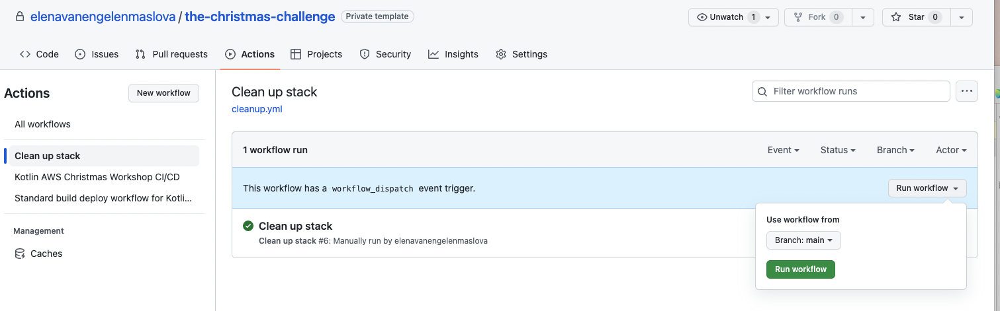

= 7. Clean up resources

To clean up serverless resources in AWS account go to GitHub actions tab and run "Clean up stack" workflow:

⬅️ link:./5-add-app-sync.adoc[5. Add AppSync configuration for GraphQL]