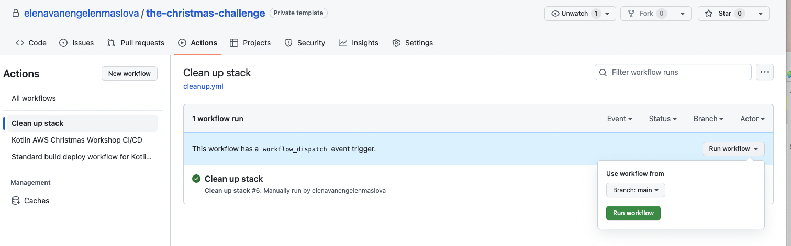

= 7. Clean up resources

Well done!  You have completed The Christmas Challenge!

NOTE: Please do this step only after we go through the solutions to The Christmas Challenge.

Now it is time to clean up.

In order to remove our serverless resources in AWS account go to GitHub and then Actions tab. Then run "Clean up stack" workflow:

⬅️ link:./6-extra-challenges.adoc[6. Extra challenges]